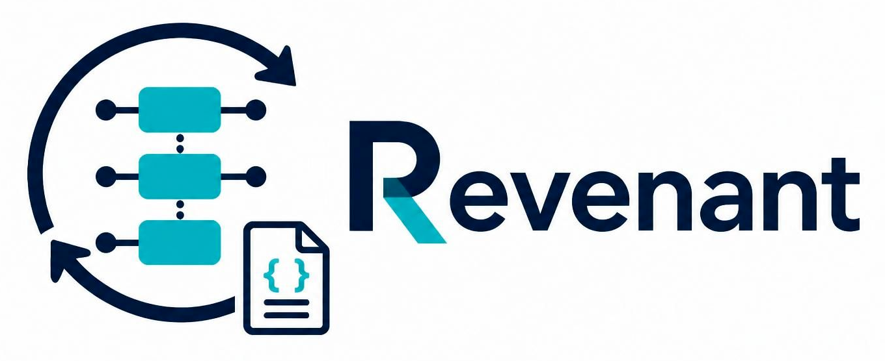

[](https://github.com/areeves/revenant)

# revenant

A crash-safe, resumable, file-based pipeline framework for Python.

Runs a chain of stages over a batch of input items, each stage running as its
own process and emitting zero, one, or many outputs per input. Progress is
durably checkpointed to plain JSON files on disk, so a crash or restart only
reprocesses the interrupted item, not the whole run. No external services
required (no Postgres, Redis, or broker)  just a single process tree writing to
a bind-mounted volume.

See [`docs/design.md`](docs/design.md) for the full design rationale.
The stage runner is fully implemented and runnable end-to-end through
the CLI, so the examples can be exercised directly from the repository.

## Install

Directly from GitHub, no PyPI publish required:

```bash
pip install git+https://github.com/areeves/revenant.git
```

Or for local development (editable install, so code changes take effect
immediately):

```bash
git clone https://github.com/areeves/revenant.git
cd revenant
pip install -e ".[dev]"
```

## Examples

See [`examples/`](examples/) for two reference pipelines (a stateful
word-count pipeline, and a planner/worker split pipeline) with
runnable `make_input.py` seed scripts.

## Design map

| Design section | Implemented in |
|---|---|
| §4 Stage config | [src/revenant/config.py](src/revenant/config.py) |
| §5–6 File formats / atomicity | [src/revenant/io_utils.py](src/revenant/io_utils.py) |
| §7–8 Drain detection / Step interface | [src/revenant/stage_runner.py](src/revenant/stage_runner.py), [src/revenant/step.py](src/revenant/step.py) |
| §9–10 CLI / Supervisor | [src/revenant/cli.py](src/revenant/cli.py), [src/revenant/supervisor.py](src/revenant/supervisor.py) |

## Quick start

Define your pipeline as a list of `StageConfig` objects:

```python
# my_pipeline.py
from revenant.config import StageConfig
from revenant.step import Step

class StepA(Step):
    def process(self, payload, state):
        yield {"doubled": payload["n"] * 2}
        return state

PIPELINE = [
    StageConfig(name="A", step_class=StepA, upstream="input"),
]
```

Seed `state/input.jsonl` with your input items (one JSON object per
line, wrapped as `{"type": "record", "seq": 1, "payload": {...}}`,
`seq` starting at 1 and increasing), then run:

```bash
revenant --pipeline my_pipeline:PIPELINE process
```

Or run/test a single stage directly:

```bash
revenant --pipeline my_pipeline:PIPELINE process --stage A --once
```

Check progress at any time:

```bash
revenant --pipeline my_pipeline:PIPELINE status
```

## Development

```bash
pip install -e ".[dev]"
pytest
```
